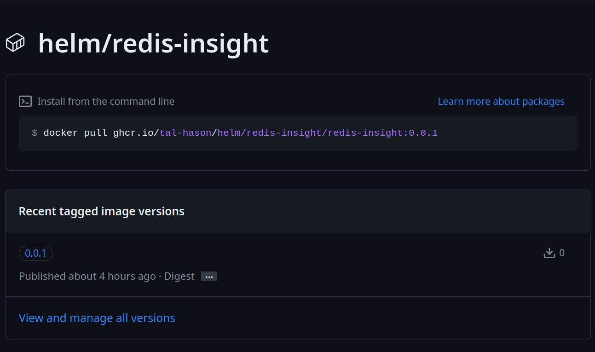

# HELM Chart to deploy REDIS Insight into Openshift

Used this chart to deploy an instance of REDIS insight ontop Red Hat Openshift and expose via Route.

How to install...

1. check the latest Package version under this Git Repo Packages.

